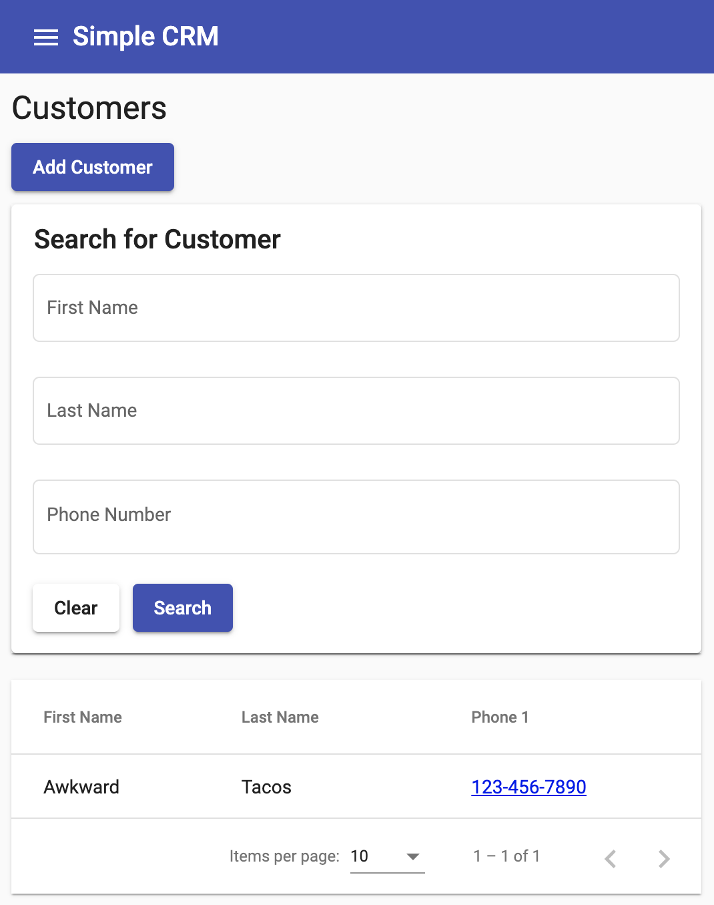
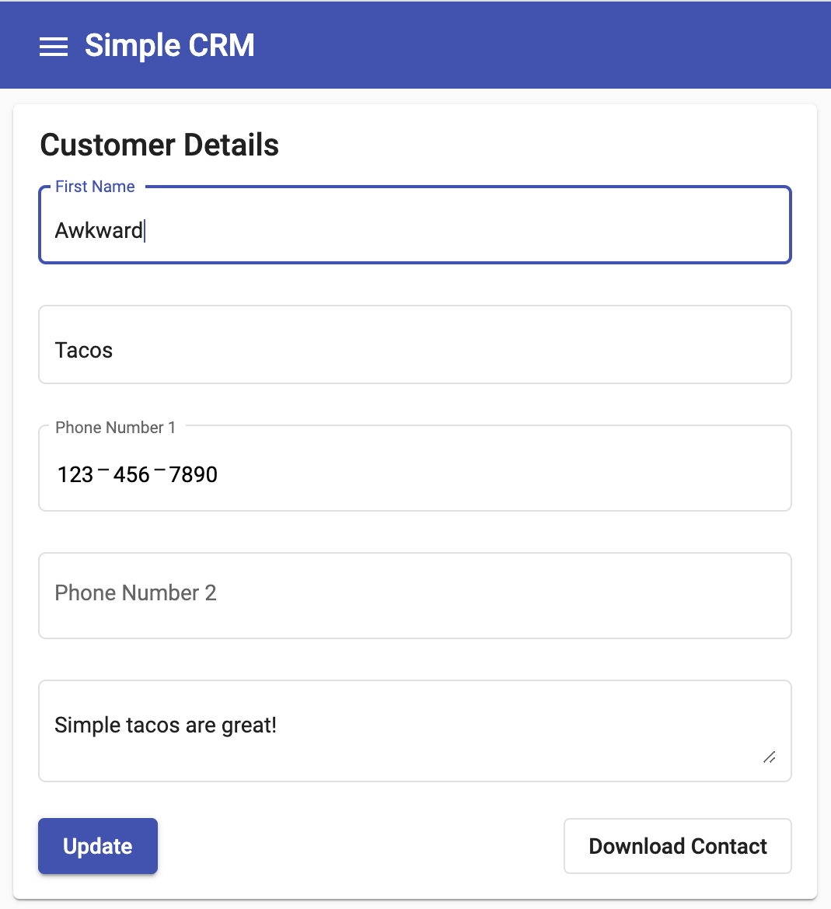
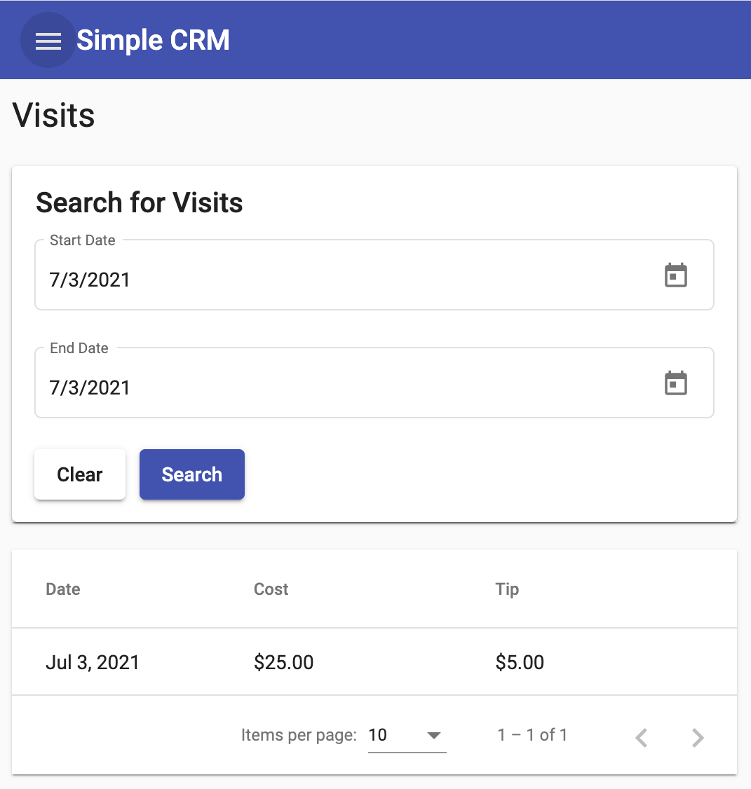
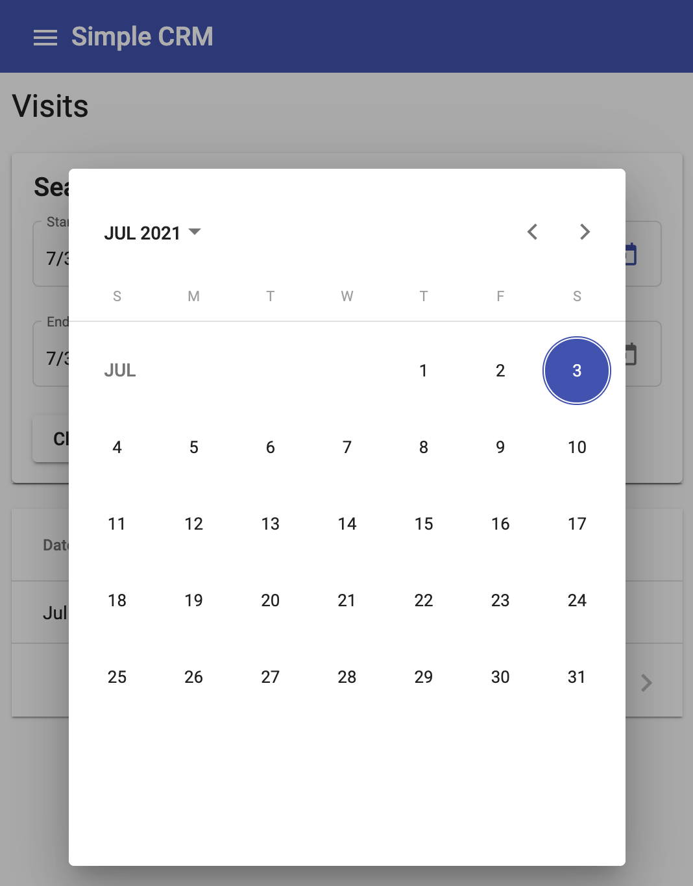
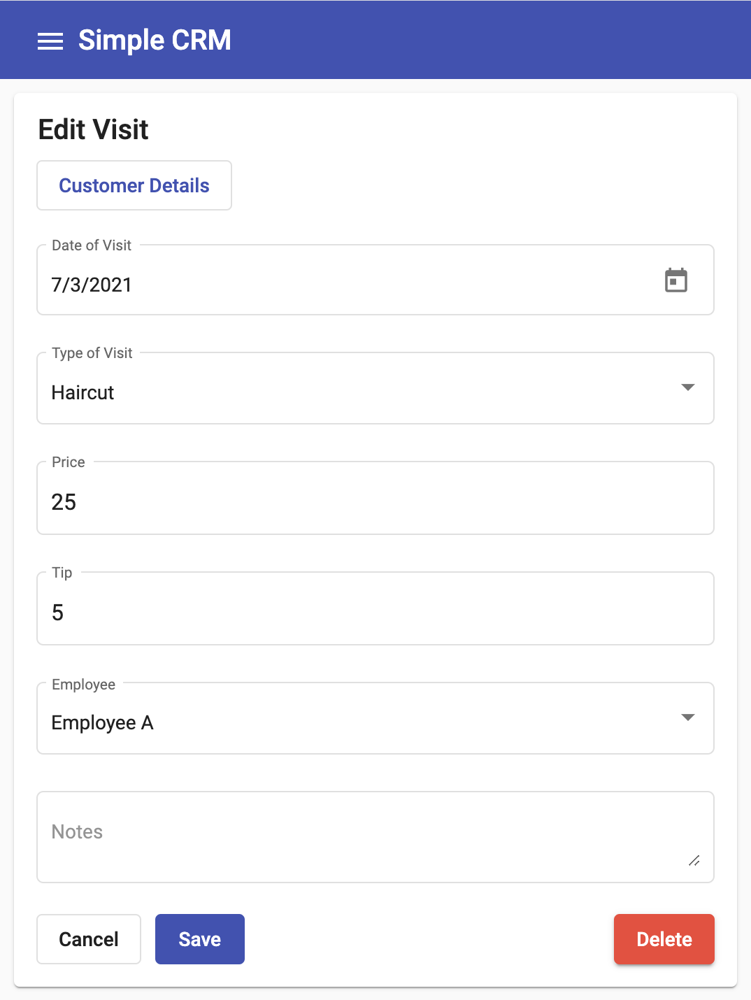

# Simple CRM
Simple CRM is an open-source customer relationship management system I built for a small business in the services industry. The goal is to provide secure access to customer data such as first name, last name, phone number, etc. and invoice information such as services provided and cost through an easy to use interface without much setup.

## Product Requirements
* All data should be accessible across device types (phone, computer, tablet)
* Multiple users should have access to the data
* Users can authenticate via email to avoid password maintenance
* Customer information (first name, last name, phone number, and notes) should be stored with future extensibility
* Invoice information (date of visit, cost, service, employee details) should be stored with future extensibility
* Ability to search for customers through a prefix matched first name, last name, or phone number
* Ability to search for invoices through a date range
* **Lowest possible cost at all times**

## Demo
https://simple-crm-ad7ce.web.app

* Hosted version of this repository hooked up to a free tier firebase plan. The current version of this repository is deployed out to this URL. There is no risk in storing the API keys in the environment variables here. For more information: https://stackoverflow.com/questions/37482366/is-it-safe-to-expose-firebase-apikey-to-the-public
* Ideally, the configurations are not stored in the repository but the configuration of a CI job to fetch the appropriate keys and update the build results in the same thing.

## Features
### Google OAuth
<a href="screenshots/login.png" target="_blank"></a>

Users authenticate with the service using Google OAuth. Restrict access through custom security rules and filtering based on `uid`.

### Customer Search
<a href="screenshots/customer_search.png" target="_blank"></a>

Search for customers through prefix matched first name, last name, and phone number. 

### Customer Editing
<a href="screenshots/customer_edit.png" target="_blank"></a>

Edit a customer details such as first name, last name, etc with custom notes.

### Invoice/Visit Search
<a href="screenshots/visit_search.png" target="_blank"></a>
<a href="screenshots/calendar_picker.png" target="_blank"></a>

Search through invoices based on date filtering.

### Invoice Editing
<a href="screenshots/invoice_edit.png" target="_blank"></a>

Edit the invoice such as date, service, employee, price, etc.

## Development
**Requirements** 
```
Angular CLI (12.0.3)
Node (16.4.1)
NPM (7.18.1)
Firebase (9.14.0)
```

**Setup**
1. Fork this repository and clone locally.
2. Setup a new project on Firebase (https://console.firebase.google.com)
3. Update `src/environments/environment.ts` and `src/environments/environment.prod.ts` with the new project.
4. Enable Google OAuth (Authentication -> Sign-in Method -> Google)
5. Create a Firestore Database
6. Update the repository locally with deployment details using `firebase init`
7. Enable GitHub Actions to enable pull-request previews

**Local Development**
1. Install dependencies using `npm install`
2. Run the dev server using `ng serve`

## Deploy to Production
1. There is already a GitHub Action setup to deploy to production. Dependencies are installed, the application is built, and deployed to Firebase hosting.
2. To deploy manually:
```
rm -rf dist
ng build
firebase deploy
```
## Security Rules
To restrict the application to only authorized users, update the `firestore.rules` to only allow authorized users. This is a first pass towards restricting access without requiring `admin` users or a UX for sign-up.

For example:
```
rules_version = '2';
service cloud.firestore {
  match /databases/{database}/documents {
    match /{document=**} {
      allow read, write: if request.auth.uid == 'awkward_tacos';
    }
  }
}
```

**This would allow any requests coming from user ID `awkward_tacos` read and write access across the application.** For more information on firestore rules: https://firebase.google.com/docs/firestore/security/get-started

## Future Improvements
* Add unit tests and e2e tests
* Add more advanced searching and filtering
* Add predictive suggestions for customer outreach
* Add monthly reporting for invoices